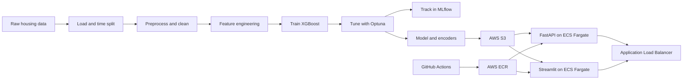

# Housing Regression MLOps

[](https://github.com/Zhannurzhan/regression_house_price/actions/workflows/ci.yml)
[](https://github.com/Zhannurzhan/regression_house_price/actions/workflows/deploy-ecr.yml)

End-to-end machine learning engineering project for housing price prediction.
The project takes a housing price dataset from raw data processing through
feature engineering, XGBoost training, experiment tracking, production
inference, API serving, dashboarding, Docker containerization, and AWS ECS
deployment with GitHub Actions CI/CD.

## Live Deployment

The application is deployed on AWS ECS Fargate behind an Application Load
Balancer.

```text
Dashboard:
http://housing-regression-alb-1226321751.eu-north-1.elb.amazonaws.com/dashboard/

API health check:
http://housing-regression-alb-1226321751.eu-north-1.elb.amazonaws.com/health
```

The live links may be unavailable when ECS service desired counts are set to
`0` for cost control.

## Project Overview

This project predicts housing prices using a production-style regression
pipeline. It is built to demonstrate practical MLOps skills rather than only
notebook-based modeling:

- Time-aware data splitting to reduce leakage risk
- Modular feature, training, inference, API, and batch pipelines
- XGBoost model training and Optuna hyperparameter tuning
- MLflow experiment tracking
- FastAPI model serving
- Streamlit dashboard for interactive holdout exploration
- Docker images for API and dashboard
- AWS S3 artifact storage
- AWS ECR image registry
- AWS ECS Fargate services
- Application Load Balancer routing
- GitHub Actions CI/CD deployment

## Architecture



The pipeline follows this flow:

```text
Load -> Preprocess -> Feature Engineering -> Train -> Tune -> Evaluate
-> Inference -> Batch -> Serve -> Deploy
```

## Repository Structure

```text
.
|-- .github/workflows/
|   |-- ci.yml                  # tests and Docker smoke checks
|   `-- deploy-ecr.yml          # build, push to ECR, deploy ECS services
|-- notebooks/                  # EDA and model development notebooks
|-- scripts/
|   `-- start_mlflow_ui.ps1
|-- src/
|   |-- api/                    # FastAPI service
|   |-- batch/                  # batch prediction job
|   |-- feature_pipeline/       # load, preprocess, feature engineering
|   |-- inference_pipeline/     # production inference logic
|   `-- training_pipeline/      # train, tune, evaluate
|-- tests/                      # unit and integration tests
|-- app.py                      # Streamlit dashboard
|-- Dockerfile                  # API image
|-- Dockerfile.streamlit        # dashboard image
|-- pyproject.toml
`-- uv.lock
```

Large artifacts are intentionally excluded from Git:

```text
data/
models/
mlruns/
mlflow.db*
.venv/
```

Model artifacts and processed datasets are stored in S3 or regenerated by the
pipeline.

## Core Modules

### Feature Pipeline

`src/feature_pipeline/`

- `load.py`: time-aware train/eval/holdout split
- `preprocess.py`: city normalization, duplicate handling, outlier removal
- `feature_engineering.py`: date features, zipcode frequency encoding, city
  target encoding, leakage-prone column removal

### Training Pipeline

`src/training_pipeline/`

- `train.py`: baseline XGBoost training
- `tune.py`: Optuna hyperparameter tuning with MLflow tracking
- `eval.py`: model evaluation with MAE, RMSE, and R2

### Inference Pipeline

`src/inference_pipeline/inference.py`

Applies the same preprocessing and encoding logic at inference time, loads the
saved model and encoders, aligns schema to the training feature columns, and
returns predictions.

### API Service

`src/api/main.py`

FastAPI service with:

- `GET /`
- `GET /health`
- `POST /predict`
- `POST /run_batch`
- `GET /latest_predictions`

On startup, the API can download required model/data artifacts from S3.

### Dashboard

`app.py`

Streamlit dashboard for holdout predictions:

- filter by year, month, and region
- call FastAPI for real-time predictions
- compare predictions against actual prices
- display MAE, RMSE, and average percent error
- plot yearly trends

## Data Leakage Prevention

The project uses several safeguards to keep model evaluation realistic:

- Time-based data splitting instead of random splitting
- Encoders fitted only on training data
- Leakage-prone columns removed before training
- Train/eval/inference schema alignment
- Saved encoders reused during inference

## Local Setup

This project uses `uv` for dependency management.

```bash
uv sync
```

Run tests:

```bash
uv run pytest -q
```

Start MLflow UI:

```bash
uv run mlflow ui
```

## Pipeline Commands

### Data Pipeline

```bash
python src/feature_pipeline/load.py
python -m src.feature_pipeline.preprocess
python -m src.feature_pipeline.feature_engineering
```

### Training Pipeline

```bash
python src/training_pipeline/train.py
python src/training_pipeline/tune.py
python src/training_pipeline/eval.py
```

### Inference

```bash
python src/inference_pipeline/inference.py \
  --input data/raw/holdout.csv \
  --output predictions.csv
```

### Batch Predictions

```bash
python src/batch/run_monthly.py
```

## Run Services Locally

Start FastAPI:

```bash
uv run uvicorn src.api.main:app --host 0.0.0.0 --port 8000
```

Start Streamlit:

```bash
uv run streamlit run app.py --server.port 8501 --server.address 0.0.0.0
```

Open:

```text
FastAPI:   http://localhost:8000/health
Streamlit: http://localhost:8501/dashboard/
```

## Docker

Build and run the API container:

```bash
docker build -t housing-api -f Dockerfile .
docker run -p 8000:8000 \
  -e AWS_REGION=eu-north-1 \
  -e S3_BUCKET=housing-regression-zhannur \
  housing-api
```

Build and run the Streamlit container:

```bash
docker build -t housing-streamlit -f Dockerfile.streamlit .
docker run -p 8501:8501 \
  -e AWS_REGION=eu-north-1 \
  -e S3_BUCKET=housing-regression-zhannur \
  -e API_URL=http://localhost:8000/predict \
  housing-streamlit
```

For CI smoke tests, S3 download can be disabled for the API container:

```bash
DISABLE_S3_DOWNLOAD=1
```

## AWS Deployment

The project is deployed in:

```text
AWS region: eu-north-1
Account: 229475224700
```

### AWS Services

- S3: stores processed datasets, model, and encoders
- ECR: stores Docker images
- ECS Fargate: runs API and dashboard containers
- Application Load Balancer: public entry point and path routing
- CloudWatch Logs: container logs
- IAM: task execution role and task role

### S3 Artifacts

The application expects these S3 keys:

```text
s3://housing-regression-zhannur/models/xgb_best_model.pkl
s3://housing-regression-zhannur/processed/feature_engineered_train.csv
s3://housing-regression-zhannur/processed/feature_engineered_holdout.csv
s3://housing-regression-zhannur/processed/cleaning_holdout.csv
```

### ECR Repositories

```text
229475224700.dkr.ecr.eu-north-1.amazonaws.com/housing-api
229475224700.dkr.ecr.eu-north-1.amazonaws.com/housing-streamlit
```

### ECS Resources

```text
Cluster: housing-regression-cluster

Task definitions:
- housing-api-task
- housing-streamlit-task

Services:
- housing-api-service
- housing-streamlit-service

Target groups:
- housing-api-tg
- housing-streamlit-tg

Load balancer:
- housing-regression-alb
```

### ALB Routing

```text
/health      -> housing-api-tg
/predict     -> housing-api-tg
/api/*       -> housing-api-tg
/dashboard*  -> housing-streamlit-tg
default      -> housing-streamlit-tg
```

## CI/CD

### CI

`.github/workflows/ci.yml`

Runs on pushes and pull requests to `main`:

```text
install dependencies
run pytest
build API Docker image
smoke test API container
build Streamlit Docker image
smoke test Streamlit container
```

### Build, Push, and Deploy

`.github/workflows/deploy-ecr.yml`

Runs manually and on deployment-relevant changes to `main`:

```text
install dependencies
run tests
configure AWS credentials
login to ECR
build and push API image
build and push Streamlit image
force new ECS deployment for API
force new ECS deployment for Streamlit
wait for ECS services to stabilize
```

Required GitHub repository secrets:

```text
AWS_ACCESS_KEY_ID
AWS_SECRET_ACCESS_KEY
```

## Environment Variables

```text
AWS_REGION                 AWS region for S3/ECS runtime
S3_BUCKET                  S3 bucket containing model/data artifacts
API_URL                    FastAPI prediction endpoint for Streamlit
DISABLE_S3_DOWNLOAD        Used in CI smoke tests
```

Production values:

```text
AWS_REGION=eu-north-1
S3_BUCKET=housing-regression-zhannur
API_URL=http://housing-regression-alb-1226321751.eu-north-1.elb.amazonaws.com/predict
```

## Testing Strategy

The test suite covers:

- time-aware data splitting
- preprocessing behavior
- feature engineering behavior
- leakage-prone column removal
- training and evaluation on temporary sample data
- Optuna tuning smoke test
- inference with temporary model and encoders

Run:

```bash
uv run pytest -q
```

## Key Dependencies

Main dependencies are defined in `pyproject.toml`.

```text
ML:              xgboost, scikit-learn, pandas, numpy
Experimentation: mlflow, optuna
API:             fastapi, uvicorn
Dashboard:       streamlit, plotly
Cloud:           boto3
Quality:         pytest, great-expectations, evidently
```

## Cost Control

To stop Fargate compute cost when not demoing:

```text
ECS -> housing-regression-cluster -> Services
Set desired tasks to 0 for:
- housing-api-service
- housing-streamlit-service
```

Set desired tasks back to `1` to bring the application online again.

The ALB, S3, ECR, and CloudWatch resources may still have small costs while
provisioned.

## Recruiter Summary

This project demonstrates the full lifecycle of a machine learning system:

```text
notebook exploration -> reproducible pipelines -> model training ->
experiment tracking -> production inference -> API and dashboard ->
Docker containers -> AWS deployment -> CI/CD automation
```

It is designed to show practical ML engineering and MLOps ability, not just
model experimentation.
